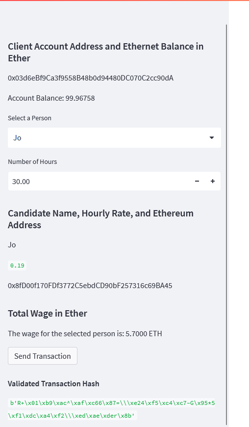
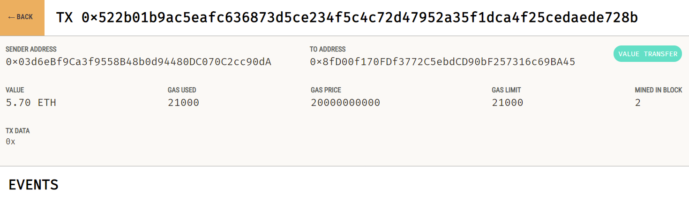

# Challenge XIX | Fintech 
---
This project is the nineteen challenge in the Columbia Fintech Bootcamp.

This challenge deals with Ethereum Blockchain process via W3 and bi44 libraries.

This application simulates a transaction between a customer and a list of 4 different developers

---

## Streamlit application

A streamlit web app is the deliverable, this app allows the creation of an interface that interacts with a local ethereum blockchain via Ganache


### Form and inputs

Streamlit form for adding record elements into the Ethereum blockchain.

Inputs include:

*   Option set for selecting a developer
*  Numeric value for the amount of hours to be paid to the developer


### Generating a transaction

In the form a transaction is generated with the above parameters, as a result we get the hash generated by the ethereum blockchain.

* Transaction 1


* Transaction 2



### Ganache Details and transaction

Every time a new record is added to the blockchain the blockchain is updated, a new value in the wallet is calculated and the hashes updates in the blockchain ledger.

* Transaction 1


* Transaction Details


* Receiver Wallet Details


* Transaction 2


* Transaction Details


* Receiver Wallet Details


* Sender Wallet Details


---

## Technologies

The main language is Python, with the following auxiliary modules/libraries.
Python version is 3.7, developed in an independent conda virtual environment

### pandas
This module handles DataFrames (dynamic tables), to maniupulate, store data, do automatic calculations and adding dynamic data.

Dataframes go hand in hand with streamlit, this permits easily printing tables and data (in this case the ledger data)

### dataclasses
This library allows the creation of dataclasses, for class member typing, this way class attributes can have a type and it automatically generates a class constructor with each attribute

### typing
Library for typing the class attributes (including list, int, float, and Any)

### datetime

Library for date and time manipulation, calculation and formatting

### streamlit

Library that creates a small web server and application that abstracts part of web development and permits the creation of simple but functional web apps including data formatting and form manipulation.

### web3

For creating and getting an account address based on a mnemonic phrase to generate an account.
It also connects to the Ganache Ethereum Blockchain server.

###  bi44

Handles ETH values conversions from Wei to ETH and creates a Wallet object
---


### Clone repository
```bash
git clone https://github.com/lumiroga/fintech-challenge19.git
```
---

## Usage

Open the terminal

Go to solution folder in your local computer

```bash
cd ./fintech-challenge19
streamlit run fintech_finder.py
```


---

## Contributors

[lumiroga](https://github.com/lumiroga)

---

## License

* mpl-2.0 | Mozilla Public License 2.0